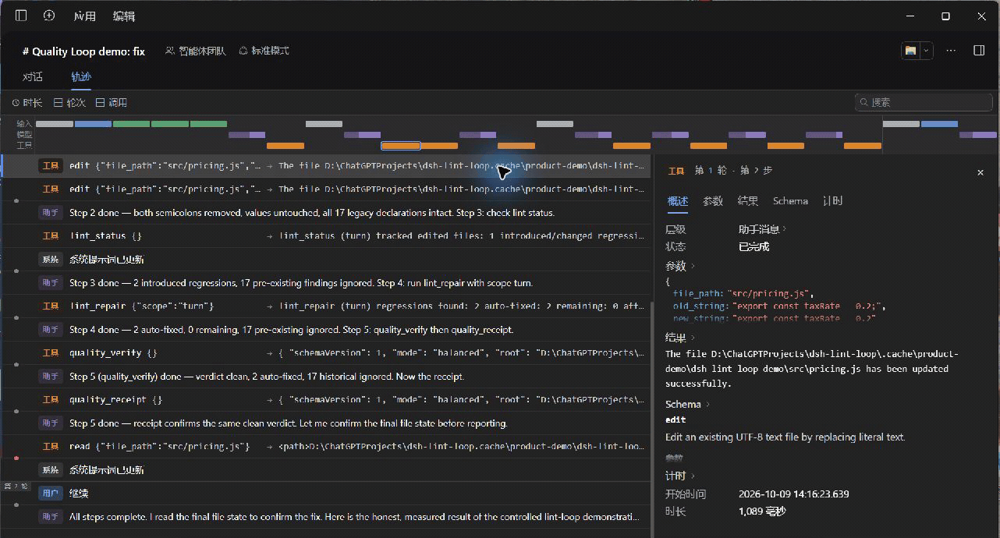

# dsh-lint-loop

[](https://www.npmjs.com/package/dsh-lint-loop) [](https://github.com/lemonxiny55/dsh-lint-loop/actions/workflows/ci.yml)

**The change-aware quality loop for [DeepSeek Harness](https://github.com/deepseek-ai/deepseek-harness).**

> **Fix what the agent broke. Ignore what was already broken. Prove the change is clean.**

Compare the agent's changes with evidence captured **before the first edit**. Keep historical failures visible, repair new lint regressions safely, and verify types and impacted tests before completion.

**v0.6.0 — Quality Loop**
English | [中文](README.zh.md)

```sh
dsh plugin --profile web add dsh-lint-loop@0.6.0
```

Replace `web` with your profile name. Desktop users can install the [published bundle](https://github.com/lemonxiny55/dsh-lint-loop/releases/download/v0.6.0/dsh-lint-loop-0.6.0.tgz) with DSH's `plugin_manager`. [Install details](#install) · [Reproduce the demo](https://github.com/lemonxiny55/dsh-lint-loop-demo).

- **Only new regressions steer the agent:** old lint, type and test failures remain recorded.
- **Two speeds:** fast lint feedback and safe repair; bounded completion checks for lint delta, types and impacted tests.
- **Proof you can inspect:** a Quality Receipt lists actual commands, executed tests, repairs, ignored debt and missing evidence.

[](https://github.com/lemonxiny55/dsh-lint-loop-demo)

**Real desktop result:** 17 historical lint issues retained · 2 new regressions safely auto-fixed · impacted tests **12/12** · lint / types / tests `clean`. The initial baseline ran **15/15**; the source was byte-identical after repair. [Raw receipt and provenance](https://github.com/lemonxiny55/dsh-lint-loop-demo/tree/main/evidence).

The 30-second GIF is a walkthrough of real saved DSH tool results, not a continuous live recording. [MP4, original captures and recording scripts](https://github.com/lemonxiny55/dsh-lint-loop-demo/tree/main/recordings). It shows the native receipt viewer; an independent Quality Bar is not shipped.

## Before → after

```text
Before the task                         Agent changes src/parser.ts
  old eslint warning                     introduces a fixable lint error
  old TS2322 in legacy.ts                breaks parser's return type
  old failing migration test             makes parser.test.ts fail

Ordinary lint wrapper                  Quality Loop
  shows old + new lint debt              Fast Lane: new lint error → safe repair
  misses type/test regressions           Completion Lane: lint delta + types + impacted tests
  can say done after lint passes         steers only for NEW regressions, at most twice
                                         keeps the old failures as historical debt
                                         emits the verification scope and final verdict
```

After the agent fixes the new type/test regressions:

```text
Quality Receipt: clean · 1 changed · lint clean / typecheck clean / tests clean
Ignored historical debt: old lint, old type error, old test failure
Tests executed: parser.test.ts; unrelated tests excluded when the dependency is provable
```

`clean` means **no new regressions in the executed scope**, not “the whole repository passes.” Missing baselines, unsupported runners, skipped tests, discovery limits, malformed output and timeouts produce `incomplete`, never a green claim. The default gate steers only on attributable new regressions; incomplete evidence remains visible in the receipt.

## Two speeds

**Fast Lane:** the existing edit → lint delta → prompt feedback loop. `lint_repair` safely repairs this turn's lint regressions. It never repairs type/test failures by rewriting code. File fixers skip historical fixable debt and roll back newly introduced lint findings or failed verification.

**Completion Lane:** at the awaited `agent/turn-stopping` checkpoint, or via `quality_verify`, check all this turn's files against the original baselines. Capture Node/TS typecheck and test baselines once before the first edit; this initial capture may run package suites and has a separate bounded budget. Later edits retain the original evidence. A completion-gate continuation within the same turn retains the **entire turn scope**, even without another edit event. A new user turn after completion/error does not inherit the ended turn's baseline.

There are at most two forced continuations and two autofix rounds per turn by default. Exhausting either budget does not turn a regression receipt green. Reads and failed writes do not join the change set. No source rewinding, stash or worktree reset is used to obtain a baseline.

## Install

Install the npm package into your DSH profile:

```sh
dsh plugin --profile web add dsh-lint-loop@0.6.0
```

For local development:

```sh
pnpm install --frozen-lockfile
pnpm build
dsh plugin --profile web add /absolute/path/to/dsh-lint-loop
```

No linter, compiler or test framework is bundled: use the repository's installed tools. Node 22/24 are supported. The DSH peer policy remains `>=0.1.0-rc.1 <0.2.0-0 || >=0.2.0-0 <0.3.0-0`; the existing Cordis peer remains `^4.0.1`.

## Modes

Use `balanced` unless you have a reason to change it. Override the existing `lint-loop` plugin row in your profile patch:

```yaml
- id: lint-loop
  config:
    mode: balanced
```

| Preset | Fast Lane | Completion Lane | Sweep budget |
|---|---|---|---|
| `fast` | lint delta + on-demand safe repair | lint only; types/tests explicitly skipped | 60s |
| `balanced` (default) | lint delta + on-demand safe repair | lint delta, repository package typechecks, impacted tests with conservative fallback | 60s |
| `strict` | same safe repair rules | lint delta, repository package typechecks and repository package test suites | 120s |

`fast` deliberately yields an incomplete full-quality receipt. `strict` broadens test scope; it still ignores historical failures and never forces unlimited work. Advanced options override the preset.

| Option | Default | Meaning |
|---|---|---|
| `completionChecks` | preset | enable typecheck/tests |
| `qualityTimeoutMs` | preset | total budget for each baseline, completion or repair sweep |
| `qualityMaxFiles` | `2000` | discovery entry budget, including directories |
| `qualityMaxChecks` | `32` | maximum package typecheck/test attempts per sweep |
| `gate`, `gateMaxSteers`, `gateSeverity` | `true`, `2`, `error` | bounded continuation and lint severity |
| `autoInject`, `settleMs`, `sectionTtlMs`, `sectionSeverity` | `true`, `600`, `30000`, `error` | post-edit prompt feedback |
| `linters`, `linterPath` | auto, `{}` | existing linter selection and executable overrides |
| `timeoutMs`, `maxFindings` | `10000`, `50` | per-linter timeout and displayed finding cap |
| `codeFrames`, `frameLines`, `frameLimit` | `true`, `1`, `5` | compact source frames |

Existing configuration names and tool arguments are retained. Package-scoped Go/Rust diagnostics keep their timeout floors; Completion Lane's overall cancellation budget still applies.

## Tools and Quality Receipt

| Tool | Use |
|---|---|
| `quality_verify` | Read-only Completion Lane; returns the complete structured Quality Receipt |
| `quality_receipt` | Retrieve this session/repository's last receipt without running checks |
| `lint_status` | Current turn's lint regressions and ignored debt |
| `lint_repair` | Bounded, regression-only safe autofix; call after editing |
| `lint_diagnostics` | File findings; `scope: all / introduced / preexisting`, severity and max filters |
| `lint_workspace_errors` | Errors in files checked this session, with regression scope |
| `lint_fix` | One-file repair; an existing baseline enforces regression-only scope |

`quality_verify` and `quality_receipt` expose the structured receipt in ordinary DSH tool results. Pure Host presenters describe running / clean / regression / failed, changed-file counts and check statuses for consumers that use that contract. **A desktop/Web Quality Bar is deferred:** the audited DSH 0.2 desktop client's renderer does not consume Host `presentCall` / `presentResult`. Delivering a dedicated bar needs client integration; v0.6 does not add a client bundle or UI hack. The automatic checkpoint saves evidence; `quality_receipt` retrieves it.

[UI audit and future capture guide](docs/quality-bar-demo.md) · [Actual desktop Receipt](docs/release-evidence/v0.6.0/desktop/rc/122-quality_receipt.json)

## Impacted tests

v0.6 supports local **Vitest** (`test: vitest` / `vitest run`) and **Jest** (`test: jest` / `jest --runInBand`) with their JSON reporters. Typechecks run local TypeScript via `tsc --noEmit --pretty false --incremental false -p tsconfig.json` for every discovered package scope. Project references are marked unavailable because `--noEmit` cannot prove rebuilt reference outputs.

Selection follows transitive reverse relative imports, including re-exports, `.js` → `.ts` resolution, index modules and directly changed `*.test.*`, `*.spec.*` / `__tests__` files. An isolated source with no provable test edge falls back to its package. Unresolved/bare workspace imports, dynamic dependencies, configuration/setup/fixture changes and customized test discovery fall back to repository package suites. Monorepo checks execute in each package's cwd and can use hoisted local binaries.

Fallbacks are recorded as `package-fallback` or `repository-fallback` with reasons. A fallback runs the wider supported suites; a discovery budget overflow stays incomplete even if discovered tests pass. Custom/chained scripts, node:test and non-Node test frameworks are reported unavailable instead of running an arbitrary command or claiming coverage. `ImpactProvider.select(plan, changed)` is the optional integration seam for a future code-index provider; v0.6 has no dependency on `dsh-code-index`.

## Regression semantics and receipts

Lint uses the existing source-aware matcher. Typecheck compares multisets of file + TS code + normalized message + source context, ignoring line shifts. Tests compare suite path + full test name + failure signature; a changed failure in an already-failing test is a regression. Startup/suite-load failures remain incomplete when they cannot be attributed reliably. Resolved failures count as `agentFixed` only after successful checks; deleted/skipped tests cannot be advertised as fixes.

Receipts include changed files, new regressions, auto-fixed and agent-fixed issues, ignored historical debt, three check statuses, actual commands/arguments and executed test identities, baseline evidence, selection reasons, autofix/continuation rounds, elapsed time and final verdict. They are isolated per session/repository. Turn completion, errors and cancellation reset baselines and repair budgets, cancel pending checks and retain the last receipt until plugin disposal. A read returns a detached snapshot. Native tool results carry their receipt through DSH's ordinary durable replay path.

Automatic repair cannot broaden file scope. eslint/biome/ruff retain safe file repair. Go/Rust package/crate repair is skipped because source snapshots cannot guarantee protection for manifests, lockfiles or neighbors. Their diagnostics and explicit standalone fixer APIs remain available. Calling `lint_fix` on a file with no earlier baseline is the backwards-compatible explicit debt-cleanup path; use `lint_repair` for agent-turn repair.

## Where this fits

| Plugin | Primary purpose |
|---|---|
| **dsh-lint-loop** | Prove this turn did not introduce lint/type/test regressions; ignore historical debt |
| [dsh-doublecheck](https://github.com/PerryLink/dsh-doublecheck) | Requirements interrogation and delivery discipline, including adversarial review |
| [dsh-test-runner](https://github.com/suimi8/dsh-test-runner) | General structured test execution and failure summaries |
| [dsh-review-loop](https://github.com/wuxiangru915/dsh-review-loop) | Human incremental diff review and checkpoints |

No LLM code review, requirements management, security scan, coverage platform or CI platform. No required companion plugins and no new linter families.

## Limits

- Only successful DSH `edit`/`write` tool mutations and the compatible fs-intent path are authoritative. Shell/custom-tool edits, deletions and concurrent external mutations are not fully attributed. A receipt describes the tracked set, not every git diff.
- Initial test/type baselines cost one bounded repository-package sweep. Flaky tests can look like regressions; suites may have side effects. Checks use local processes, as the existing linter runner does; they are not a sandbox boundary.
- Static dependency selection is conservative, not a complete language/runtime index. Generated files, assets and nonliteral runtime dependencies require broader evidence; unknown patterns should be configured to a supported runner or assessed separately.
- Missing linters, missing compiler/test runners, custom scripts, TypeScript reference builds, skipped tests and unparsed output remain incomplete. The gate does not demand historical cleanup or invent a result.
- Host presenters are tested against DSH 0.1/0.2 contracts. The current built-in desktop/Web renderer does not consume them; a dedicated Quality Bar is deferred. The demo captures ordinary native tool results, not a custom Quality Bar.

[Architecture audit and design](docs/quality-loop-design.md) · [Candidate validation evidence](docs/release-evidence/v0.6.0/verification.md)

## Development

```sh
pnpm install --frozen-lockfile
pnpm typecheck
pnpm test
pnpm build
```

CI covers Windows/Linux × Node 22/24. Tests include real TypeScript/Vitest integration, historical debt, duplicate diagnostics, safe autofix/rollback, impacted selection/fallback, monorepos, bounded retries, cancellation/timeouts, native presenters, disposal/remount and Windows argument handling.

[Feedback and discussions](https://github.com/lemonxiny55/dsh-lint-loop/discussions) · [MIT License](LICENSE)
